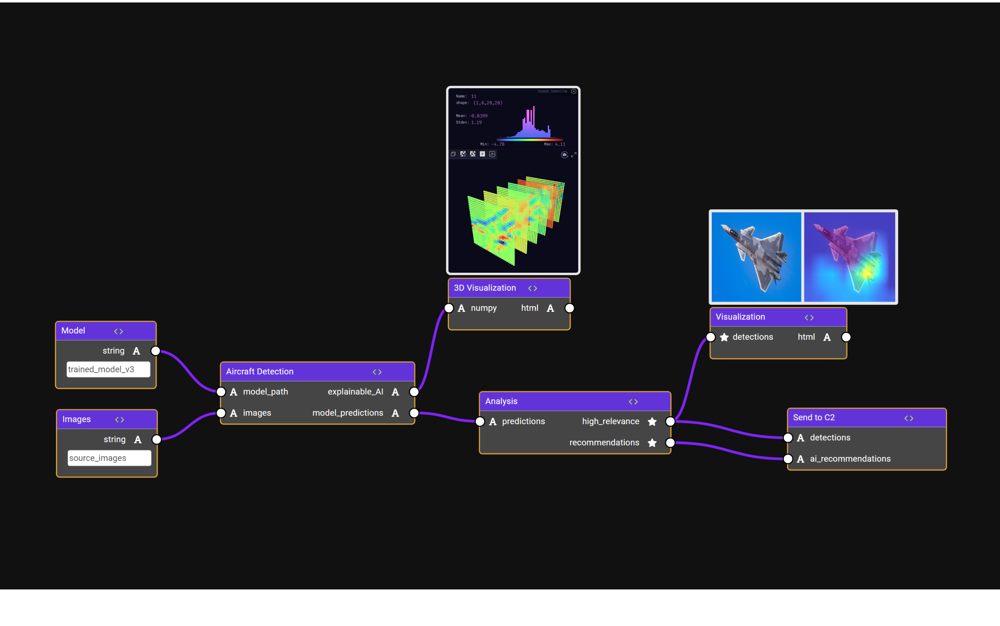
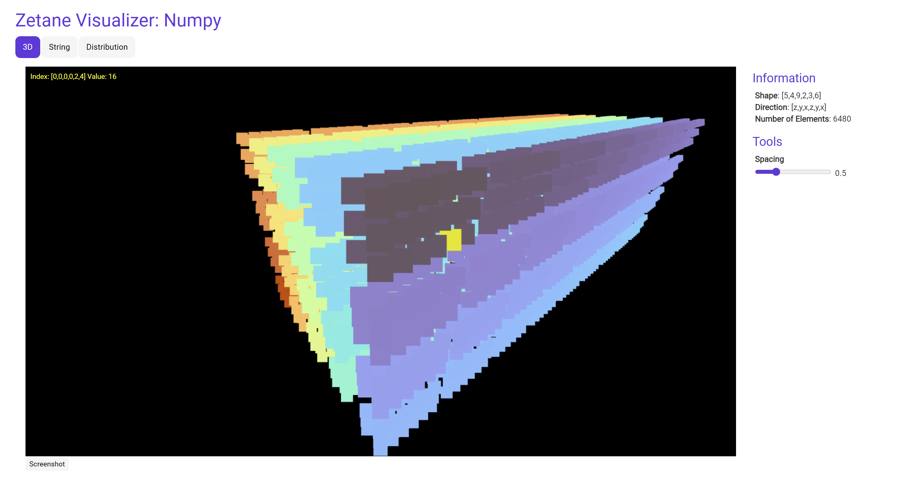
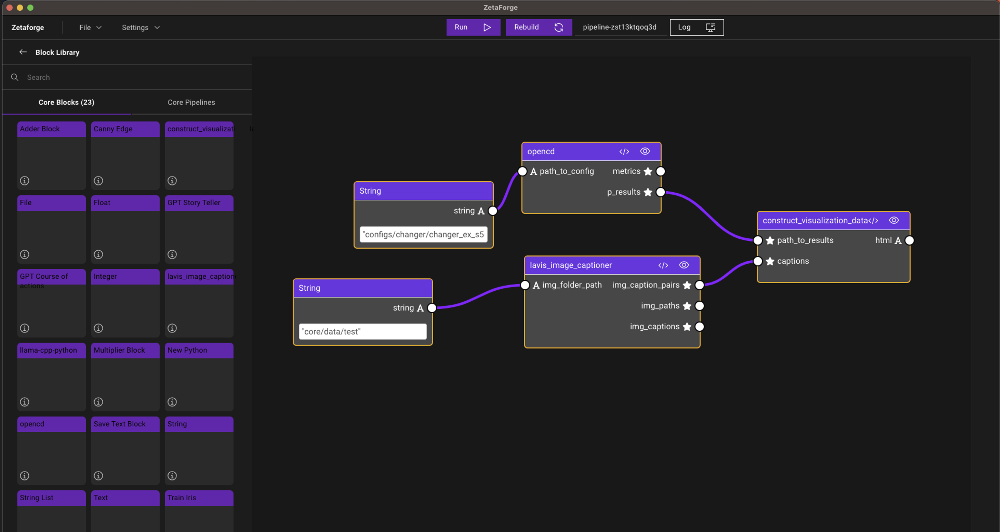
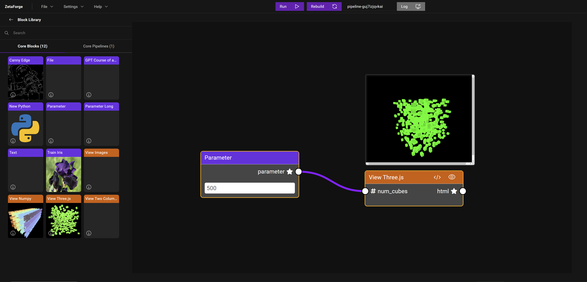

<div align="center">


[](https://badge.fury.io/py/zetaforge)
[](https://discord.gg/zetaforge)
[](https://twitter.com/ZetaneSystems)
[](https://www.youtube.com/channel/UCGDwKqB1HPjEdw97jm4wTFA)


<h3 style="padding-bottom: 15px">
Open source AI platform for rapid development of advanced AI and AGI pipelines.
</h3>
</div>





<a id="why-zetaforge"></a>
## 🔥 Why ZetaForge?

ZetaForge is an AI platform designed to accelerate the development and deployment of advanced AI solutions. It allows users to assemble reusable, customizable, and containerized Blocks into highly visual AI Pipelines, enabling rapid experimentation and collaboration.

- **Language Agnostic:** Work with AI technologies in any programming language.
- **Dynamic:** Easily modify and update AI pipelines with new or improved components.
- **Full Code Accessibility:** Dive into the code whenever needed while enjoying a user-friendly interface.
- **Community and Sharing:** Utilize community-driven blocks and pipelines, and share your own creations.


> ⭐ Support us by starring this repo.


## 📰 Breaking News
We've launched the first release of ZetaForge! Start building AI pipelines with our core features. 

New blocks and pipelines have been added to the core library.

Expect regular updates with new enhancements.


>👁 Watch this repo to stay in the loop about changes and updates.

## Getting Started

**Installation**
You can install ZetaForge Python Package through pip by running the following command in your terminal:

```
pip install zetaforge
```

Or, you can clone the ZetaForge GitHub repository and install from source by running:

```
git clone https://github.com/zetane/zetaforge
cd zetaforge
pip install .
```


**Install Docker Desktop and Enable Kubernetes**

You need to install Docker Desktop or any other container runtime that includes Kubernetes integration.
Follow the instructions to [install Docker Desktop](https://docs.docker.com/desktop/) from their official website.
You will need to [enable Kubernetes](https://docs.docker.com/desktop/kubernetes/) to use ZetaForge.

> Note: We recommend [OrbStack](https://orbstack.dev/download) to macOS users for efficiency and performance reasons.

## Launch ZetaForge

To launch ZetaForge, run the following command after installing via pip:
```
zetaforge launch
```

This will set up the correct services in Kubernetes, check that they are running, and then launch ZetaForge. 

If something goes wrong, you can run:

```
zetaforge setup
```

to reconfigure the container services. 

To teardown and remove the Kubernetes services, you can run:

```
zetaforge teardown
```


## Run your First Pipeline


To experience ZetaForge in action, start by dragging and dropping a core pipeline, such as the "Canny Edge Pipeline," from the Core Pipelines Library into your workspace. Once the pipeline is loaded, click the "Run" button to see the magic happen!

## Core Blocks and Pipelines

You can drag and drop these blocks and pipelines from the side library.

#### Compute Blocks

Social Posts Maker, OpenAI agent, Stable Diffusion, Background Removal, Images to Video, Canny Edge, QR Code Maker and [many more](./frontend/core/blocks).

#### View Blocks

View 3D Numpy, Images, Videos, Text and [many more](./frontend/core/blocks).

#### Demo Pipelines

-[Social Media Post Maker with Image Content](./frontend/core/pipelines/pipeline-post-maker)
-[Invader Game](./frontend/core/pipelines/pipeline-invader-game)
-[Image Background Removal](./frontend/core/pipelines/pipeline-background-removal)
-[Images to Video](./frontend/core/pipelines/pipeline-images-to-video)

## Documentation

Explore our [official documentation](https://zetane.com/docs/) for a guide on using ZetaForge. Learn how to create your own ZetaForge blocks, assemble custom pipelines, and more. You'll also find tutorials and best practices to enhance your ZetaForge experience. 

If you prefer reading a blog instead, check out our 3-part blog on [Medium](https://medium.com/zetane-blog/create-your-multimedia-ai-generated-storybook-with-zetaforge-part-i-9aae9860a493) that goes through the motivation as well as many technical details through an exciting example: **Create Your Multimedia AI-generated Storybook with ZetaForge** ([Part I](https://medium.com/zetane-blog/create-your-multimedia-ai-generated-storybook-with-zetaforge-part-i-9aae9860a493), [Part II](https://medium.com/zetane-blog/zetaforge-use-case-example-a-multimedia-ai-generated-storybook-part-ii-4668c2d9360d), [Part III](https://medium.com/zetane-blog/zetaforge-use-case-example-a-multimedia-ai-generated-storybook-part-iii-6b79f60c5a56))!


## Pipeline Gallery

**Visualize Multidimensional Numpy Arrays**



**Integrate Popular GitHub Repos in AI Pipeline**
(LAVIS and Open-CD)



**Use Three.js Visualization Blocks**




## Share a Pipeline

To share a pipeline with your team, follow these steps:

1. **Save:** Go to `File` -> `Save` or `Save As`, choose a target folder, and name your pipeline.
2. **Package and Send:** Zip the saved folder, which contains all necessary files, and share it with your team.
3. **Load and Run:** Team members can unzip the folder, load the pipeline via `File` -> `Load` -> `Pipeline`, and click `Run` to replicate the results.

This streamlined process ensures easy sharing and consistent results across your team.


## Contributing

ZetaForge is under active development. We welcome contributions from the community to make our project even better! 

Before contributing, please take a moment to review our [Contribution Guide](CONTRIBUTING.md) to see our guidelines.
Whether it's improving documentations, reporting bugs, suggesting new features, or submitting code changes, 
your contributions help us improve the project for everyone. 

## License

- **[AGPL license](https://opensource.org/license/agpl-v3/)**
- If you need another type of license please contact us [here](https://zetane.com/contact-us).

## Contact

- Reach out to us on [Discord](https://discord.gg/zetaforge) if you have any questions or issues.
- ZetaForge Homepage: [https://www.zetaforge.com/](https://www.zetaforge.com/)


<!-- ## Star History

[](https://star-history.com/#zetane/viewer&Date)


## Contributors

Thanks go to these awesome contributors

<a href="https://github.com/zetane/viewer/graphs/contributors">
  
</a> -->
