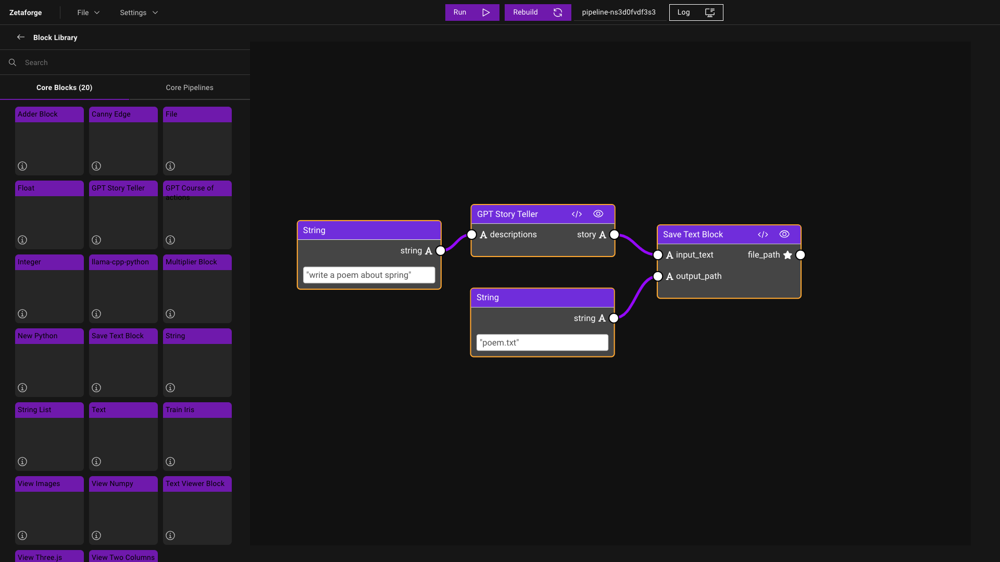

# Assemble a Pipeline

A Pipeline is composed of Blocks. To construct a Pipeline, drag and drop Blocks into your workspace and connect the Blocks by adding links between the output of one Block and the input of the next Block. ZetaForge supports directed acyclic connections between the Blocks.

The changes made to the workspace are saved in `frontend/.cache`. When the first Block is added to an empty workspace, a new directory (`pipeline-${pipeline_id}`) will be created under `frontend/.cache` for the Pipeline representing the workspace. The information about the pipeline, such as the Blocks making the pipeline and the connections between them, is stored in a JSON file with the same name as the pipeline, i.e., `pipeline-${pipeline_id}.json`. Note that the `${pipeline_id}` is displayed at the top of the window in the ZetaForge app.

For each Block added to the workspace, a new directory will be created in `frontend/.cache/pipeline-${pipeline_id}` containing the Block files. Also, for each connection made between the Blocks, the `pipeline-${pipeline_id}.json` file gets updated to save the links between the Blocks.

## Saving and Loading a Pipeline

You can save a Pipeline using the Save button in the `File` menu. Saved Pipelines can be loaded later from the same menu using the `Load` button.

## Example

Let's say we want to create a simple Pipeline that takes a prompt as input, generates a short story based on that prompt, and saves the story as a text file. To build this Pipeline, we need four Blocks:

1. **String Block**: to take the input prompt.
2. **Story Teller Block**: that takes a prompt and uses a GPT-like model to generate the story.
3. **Save Text Block**: that takes in an input string and a file path and saves the generated text for us.
4. **String Block**: that stores the path to the output text file.

Refer to [Create Blocks](create-blocks.md) to find more information about creating Blocks. Assuming we already have all the four Blocks in the `Core Blocks` menu on the sidebar, we can start building the Pipeline.

We start by adding the GPT Story Teller Block. As soon as the GPT Story Teller is added to the workspace, you can see a new directory is created in `frontend/.cache`, e.g., `pipeline-ns3d0fvdf3s3`. Inside this folder, there is a JSON file representing this Pipeline, called `pipeline-ns3d0fvdf3s3.json`, as well as a directory called `gpt-storyteller-5o7a1lfvy2td` that includes all the Block files.

Next, we add the String Block. Since the String Block is a primitive type Block ([learn more about Block types](create-blocks.md#block-components)), it does not have any Block files, e.g., `computations.py`, `Dockerfile`, etc. Therefore, no new directory is created for this Block. The only thing that changes is the JSON file that now includes two Blocks; `string-yjebz1z8shms` and `gpt-storyteller-5o7a1lfvy2td`.

Before adding the final Block, let's try adding links between the String Block and the GPT Story Teller Block. We connect `string`, which is the output node of the String Block, to `descriptions`, the input node of the GPT Story Teller Block. To see how adding this link modified the Pipeline, we take a look at the `pipeline-ns3d0fvdf3s3.json` file. We can see that `pipeline["string-yjebz1z8shms"]["outputs"]["connections"]` has been modified and now contains information about the link we just made. The information includes the Block name in `block` as well as the node name in `variable`. In addition to this, `pipeline["gpt-storyteller-5o7a1lfvy2td"]["outputs"]["connections"]` has also been updated to reflect the new link made to the GPT Story Teller Block's input node.

Finally, we add the Save Text Block to store the story GPT generated to a file and another String Block to enter the save location. We will then fill in the String Block with the prompt and choose the output file path in the String Block to get everything ready. In the `pipeline-ns3d0fvdf3s3.json` file, you can see the values for these Blocks being updated in `pipeline["string-yjebz1z8shms"]["action"]["parameters"]["string"]` and `pipeline["gpt-storyteller-5o7a1lfvy2td"]["action"]["parameters"]["output_path"]` as the links are made.

We run the Pipeline by clicking on the Run button at the top of the window. Here is a screenshot of the full Pipeline:

